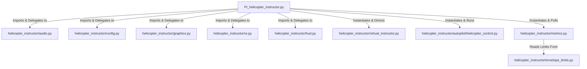

# Developer Documentation: Helicopter Flight Instructor

Welcome to the Helicopter Flight Instructor codebase. This document outlines the project's architecture, code style guidelines, and verification practices to maintain standard development quality.

---

## 1. Code Style Guidelines

All Python code in this repository conforms to the **[Google Python Style Guide](https://google.github.io/styleguide/pyguide.html)**. Developers must follow these rules when contributing to any module:

### 1.1 Line Length & Formatting
- **Line Length**: Limit all lines to a maximum of **80 characters**.
  - *Exceptions*: Long pathnames/URLs in comments, or long raw strings in expressions where breaking them would decrease readability.
- **Indentation**: Use exactly **4 spaces** per indentation level. Do not use tabs.
- **Blank Lines**: 
  - Separate top-level function and class definitions with **two blank lines**.
  - Separate method definitions inside a class with **one blank line`.

### 1.2 Import Ordering
Imports must be grouped in the following order, with groups separated by a single blank line:
1. **Standard Library** imports (e.g. `math`, `os`, `json`).
2. **Third-Party / External** libraries (e.g. `xp`, `imgui`).
3. **Local Application** packages (e.g. modules under `helicopter_instructor`).

Within each group, imports should be sorted alphabetically.

### 1.3 Docstrings & Comments
- Every module, class, and public function must have a descriptive docstring.
- Docstrings should use the **Google Docstring Format** to describe parameters and return values:
  ```python
  def example_function(plugin, filename):
      """Brief description of what the function does.

      Args:
          plugin: The PythonInterface instance.
          filename: A string filename.

      Returns:
          An integer 1 indicating success.
      """
  ```

---

## 2. Architecture & Refactoring

The plugin is designed for X-Plane using a clean, modular structure. The main entry point loaded by X-Plane is `PI_helicopter_instructor.py`. To keep the entry point minimal and easy to maintain, it delegates its sub-responsibilities to specialized sub-modules inside the `helicopter_instructor` package:



### 2.1 Subsystem Responsibilities
- **[audio.py](../plugin/helicopter_instructor/audio.py)**: OpenAL/FMOD WAV playback, volume management, and Text-to-Speech fallbacks.
- **[config.py](../plugin/helicopter_instructor/config.py)**: Auto-detects the active X-Plane aircraft model, and handles saving/loading PID tuning gains to JSON.
- **[graphics.py](../plugin/helicopter_instructor/graphics.py)**: Programmatic solid PNG texture generation, OBJ8 3D model writing, and Vulkan/Metal instance binding.
- **[ui.py](../plugin/helicopter_instructor/ui.py)**: ImGui settings window drawing, training curriculum management, and live gains tuning interface.
- **[hud.py](../plugin/helicopter_instructor/hud.py)**: Renders the OSD overlays, alt safety bar, and PyOpenGL scaled vector crosshairs.
- **[virtual_instructor.py](../plugin/helicopter_instructor/virtual_instructor.py)**: Curricular state machine (6 phases), hardware interlocks, safety envelope polling, and linear soft blended interventions.
- **[helicopter_control.py](../plugin/helicopter_instructor/autopilot/helicopter_control.py)**: Dual-mode cascaded PID control loop calculations (hover/cruise) and local coordinate translations.
- **[metrics.py](../plugin/helicopter_instructor/metrics.py)**: Keeps sliding window telemetry history, computes pilot precision, smoothness (OCI), safety EPS, coaching tips, and caches verbal WAV files.
- **[envelope_limits.py](../plugin/helicopter_instructor/envelope_limits.py)**: Central single source of truth for all warning, caution, green zone, and takeover thresholds.

### 2.2 Dependency Injection Pattern
To maintain thread safety and seamless state sharing without complex callbacks, all modularized functions utilize a **dependency injection** pattern. They accept the main `PythonInterface` class instance (passed as `plugin` or `self`) as their first argument:

```python
# Entry point delegates the call passing 'self'
def load_gains(self):
    config.load_gains(self)
```

---

## 3. Testing & Verification

We use standard Python unit tests to verify the correctness of autopilot calculations, state machine transitions, and UI drawing triggers.

### 3.1 Running the Tests
To execute the automated test suite, run the following command from the `v2/` root directory:
```bash
python -m unittest discover tests
```

Ensure all tests pass successfully (`OK`) before committing or releasing any code.

### 3.2 Checking Test Coverage
To measure and analyze code coverage of the test suite, follow these steps from the `v2/` root directory:

1. **Install Coverage**:
   Install the `coverage` module via pip if it's not already present:
   ```bash
   pip install coverage
   ```

2. **Run Tests with Coverage**:
   Execute the test suite with coverage collection active:
   ```bash
   python -m coverage run -m unittest discover tests
   ```

3. **Generate Terminal Report**:
   View a quick summary table in the terminal including missing line numbers:
   ```bash
   python -m coverage report -m
   ```

4. **Generate Interactive HTML Report (Optional)**:
   Create an interactive, colored HTML visual breakdown:
   ```bash
   python -m coverage html
   ```
   Open `htmlcov/index.html` in your web browser to browse line-by-line coverage for each file.
