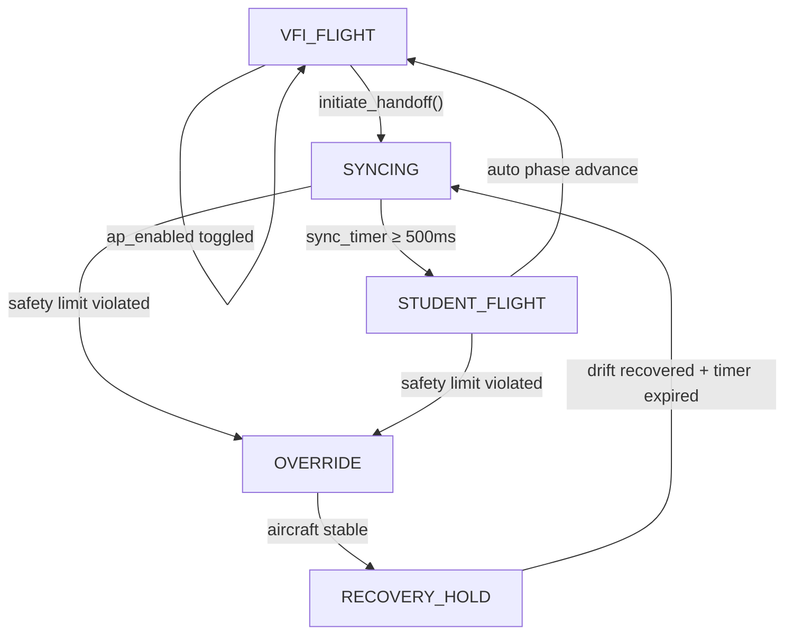

# VFI State Machine — Analysis & Modernization Recommendations

## Current Architecture Overview



The state machine is spread across two primary files:

| File | Role |
|---|---|
| [virtual_instructor.py](file:///Users/leczb/Documents/private/github/helicopter-instructor/v2/plugin/helicopter_instructor/virtual_instructor.py) | Core transition logic, safety checks, sync/recovery processing |
| [PI_helicopter_instructor.py](file:///Users/leczb/Documents/private/github/helicopter-instructor/v2/plugin/PI_helicopter_instructor.py) | Flight loop orchestration, audio routing, phase advance, control routing, **direct state mutation** |

---

## Issues Found

### 1. 🔴 No State Enum — Raw String Comparisons Everywhere

States are plain strings (`"VFI_FLIGHT"`, `"SYNCING"`, etc.) with no constants, no enum, and no validation. A typo like `"STUDET_FLIGHT"` would silently fail. There are **~35+ raw string comparisons** scattered across 4 files:

| File | Approximate count | Example lines |
|---|---|---|
| [virtual_instructor.py](file:///Users/leczb/Documents/private/github/helicopter-instructor/v2/plugin/helicopter_instructor/virtual_instructor.py) | ~14 | L70, L131, L180, L214-L230, L376, L485, L533 |
| [PI_helicopter_instructor.py](file:///Users/leczb/Documents/private/github/helicopter-instructor/v2/plugin/PI_helicopter_instructor.py) | ~14 | L113, L132, L950, L962, L989, L1029-L1069 |
| [ui.py](file:///Users/leczb/Documents/private/github/helicopter-instructor/v2/plugin/helicopter_instructor/ui.py) | ~5 | L124-L134 |
| [hud.py](file:///Users/leczb/Documents/private/github/helicopter-instructor/v2/plugin/helicopter_instructor/hud.py) | ~6 | L236, L268-L298 |

The same pattern extends to **authority strings** (`"VFI"` / `"STUDENT"`) and **envelope strings** (`"Excellent"` / `"Good"` / `"Unstable"`), which are also raw strings compared in multiple locations.

---

### 2. 🔴 External State Mutation — Plugin Bypasses Instructor API

The plugin directly sets `instructor.system_state` in at least **3 places**, bypassing the instructor's own transition methods:

```python
# PI L113 — ap_enabled engage
self._plugin.instructor.system_state = "VFI_FLIGHT"

# PI L132 — ap_enabled disengage
self._plugin.instructor.system_state = "VFI_FLIGHT"

# PI L989 — auto phase advance
self.instructor.system_state = "VFI_FLIGHT"
```

It also directly mutates `control_assignment`, `sync_locked`, and `phase` at [L990-L1002](file:///Users/leczb/Documents/private/github/helicopter-instructor/v2/plugin/PI_helicopter_instructor.py#L988-L1010). This means transition invariants are not enforced centrally — any caller can put the machine in an inconsistent state.

---

### 3. 🟡 Hardcoded Safety Thresholds Violate §3.1

[`check_safety_limits()`](file:///Users/leczb/Documents/private/github/helicopter-instructor/v2/plugin/helicopter_instructor/virtual_instructor.py#L246-L316) and [`process_recovery()`](file:///Users/leczb/Documents/private/github/helicopter-instructor/v2/plugin/helicopter_instructor/virtual_instructor.py#L493-L541) contain **8+ magic numbers** that should live in `envelope_limits.py` per AGENTS.md §3.1:

| Magic Number | Meaning | Line |
|---|---|---|
| `15.0` | Attitude limit (pitch/roll) | L256, L259 |
| `30.0` | Yaw rate limit (°/s) | L262 |
| `300.0` | Vertical speed limit (ft/min) | L268 |
| `12.0` | Ground speed limit (knots) | L276 |
| `2.0` / `10.0` | AGL limits (meters) | L281 |
| `2.0` (recovery) | Stable attitude threshold | L531 |
| `-50.0` (recovery) | Arrested sink rate (ft/min) | L531 |
| `1.0` (recovery) | Stable ground speed (knots) | L531 |

---

### 4. 🟡 No Formal Transition Table

Transitions are embedded across `update()`, `initiate_handoff()`, `process_synchronization()`, `trigger_hard_override()`, `process_recovery()`, and the plugin's step C4. There is **no single place** that defines or enforces which transitions are legal. For example:

- `initiate_handoff()` doesn't validate the current state before transitioning to `SYNCING`
- Nothing prevents calling `trigger_hard_override()` from `VFI_FLIGHT`
- The `RECOVERY_HOLD → SYNCING` transition happens inside the `update()` elif, while `OVERRIDE → RECOVERY_HOLD` happens inside `process_recovery()`

---

### 5. 🟡 Duplicated State Display Logic

Both [ui.py](file:///Users/leczb/Documents/private/github/helicopter-instructor/v2/plugin/helicopter_instructor/ui.py) and [hud.py](file:///Users/leczb/Documents/private/github/helicopter-instructor/v2/plugin/helicopter_instructor/hud.py) have near-identical if/elif chains mapping states → display labels and colors. Adding a new state requires updating both files independently.

---

### 6. 🟡 Mixed Responsibilities in the Flight Loop

The flight loop callback ([L866-L1242](file:///Users/leczb/Documents/private/github/helicopter-instructor/v2/plugin/PI_helicopter_instructor.py#L866-L1242)) interleaves seven distinct concerns that should be more clearly separated:

| Concern | Lines |
|---|---|
| Recovery target snapping | L907-L921 |
| VFI state machine tick | L944-L947 |
| Metrics update | L962-L965 |
| Auto phase advance orchestration | L978-L1010 |
| PID reset on transition | L1029-L1033 |
| Audio cue routing | L1041-L1069 |
| Control axis routing to X-Plane | L1075-L1113 |

---

### 7. 🟢 `transition_pending` Flag Pattern

[`maybe_advance_phase()`](file:///Users/leczb/Documents/private/github/helicopter-instructor/v2/plugin/helicopter_instructor/virtual_instructor.py#L385-L413) sets a flag that the plugin polls **in the same frame** ([L982](file:///Users/leczb/Documents/private/github/helicopter-instructor/v2/plugin/PI_helicopter_instructor.py#L982)). This cross-boundary handshake could be replaced by a return value or callback, eliminating mutable shared state.

---

### 8. 🟢 Fragile Caption-Based Color Routing

[hud.py L423-L428](file:///Users/leczb/Documents/private/github/helicopter-instructor/v2/plugin/helicopter_instructor/hud.py) determines caption color by substring matching against the caption text (`"I HAVE"`, `"YOU HAVE"`, `"PREPARE"`). Changing caption wording would silently break the color logic.

---

## Recommendations

### Phase 1: Type Safety (Low Risk, High Impact)

1. **Introduce a `VFIState` enum** in `virtual_instructor.py` and replace all raw string comparisons:
   ```python
   from enum import Enum

   class VFIState(Enum):
       VFI_FLIGHT = "VFI_FLIGHT"
       SYNCING = "SYNCING"
       STUDENT_FLIGHT = "STUDENT_FLIGHT"
       OVERRIDE = "OVERRIDE"
       RECOVERY_HOLD = "RECOVERY_HOLD"
   ```
   This gives you IDE autocompletion, typo detection at import time, and `isinstance` type narrowing.

2. **Add `Authority` and `Envelope` enums** for the `"VFI"`/`"STUDENT"` and `"Excellent"`/`"Good"`/`"Unstable"` strings respectively.

3. **Add state display metadata** as properties on the enum (label, color) to eliminate the duplicated if/elif chains in ui.py and hud.py:
   ```python
   class VFIState(Enum):
       VFI_FLIGHT = "VFI_FLIGHT"
       # ...

       @property
       def display_label(self):
           return _STATE_LABELS[self]

       @property
       def display_color(self):
           return _STATE_COLORS[self]
   ```

---

### Phase 2: Encapsulate Transitions (Medium Risk, High Impact)

4. **Add formal transition methods** for all state changes and make `system_state` a property with a setter that validates transitions:
   ```python
   _VALID_TRANSITIONS = {
       VFIState.VFI_FLIGHT: {VFIState.SYNCING},
       VFIState.SYNCING: {VFIState.STUDENT_FLIGHT, VFIState.OVERRIDE},
       VFIState.STUDENT_FLIGHT: {VFIState.OVERRIDE, VFIState.VFI_FLIGHT},
       VFIState.OVERRIDE: {VFIState.RECOVERY_HOLD},
       VFIState.RECOVERY_HOLD: {VFIState.SYNCING},
   }
   ```
   The plugin should **never** write `instructor.system_state = ...` directly. Instead, provide explicit methods:
   - `reset_to_vfi_flight()` — for engage/disengage/phase-advance
   - `initiate_handoff()` — already exists
   - `trigger_hard_override()` — already exists

5. **Move phase advance orchestration** into the instructor. The plugin currently handles the `VFI_FLIGHT → set phase → initiate_handoff()` sequence at [L978-L1010](file:///Users/leczb/Documents/private/github/helicopter-instructor/v2/plugin/PI_helicopter_instructor.py#L978-L1010). This transition logic belongs in the instructor; the plugin should only handle the X-Plane side effects (audio, PID reset).

6. **Return transition events** from `instructor.update()` instead of using flags:
   ```python
   result = self.instructor.update(dt, telemetry, hw, vfi)
   # result.commands = {"roll": ..., "pitch": ..., ...}
   # result.events = [StateChanged(OVERRIDE), PhaseAdvanced(3)]
   ```

---

### Phase 3: Extract Safety Limits (Low Risk)

7. **Move all hardcoded thresholds** from `check_safety_limits()` and `process_recovery()` into `envelope_limits.py` with descriptive names:
   ```python
   # envelope_limits.py
   LIMIT_ATTITUDE_DEG = 15.0
   LIMIT_YAW_RATE_DEG_S = 30.0
   LIMIT_VSPEED_FT_MIN = 300.0
   LIMIT_GS_KNOTS = 12.0
   LIMIT_AGL_MIN_M = 2.0
   LIMIT_AGL_MAX_M = 10.0
   LIMIT_RECOVERY_ATTITUDE_DEG = 2.0
   LIMIT_RECOVERY_SINK_FT_MIN = -50.0
   LIMIT_RECOVERY_GS_KNOTS = 1.0
   ```
   Add corresponding contract tests in `test_limits_contract.py`.

---

### Phase 4: Resolve Caption Color Fragility (Low Risk)

8. **Replace substring matching** with an explicit caption-type parameter:
   ```python
   def set_hud_caption(self, text, duration=3.0, style="info"):
       """Styles: 'danger' (red), 'success' (green), 'warning' (orange), 'info' (white)"""
   ```
   The HUD reads `style` instead of guessing from the text content.

---

## Suggested Priority

| Priority | Issue | Effort | Impact |
|---|---|---|---|
| **P0** | State enum + Authority/Envelope enums | ~2h | Eliminates entire class of typo bugs |
| **P0** | Extract hardcoded safety limits | ~1h | Compliance with AGENTS.md §3.1 |
| **P1** | Encapsulate state transitions (property + methods) | ~3h | Prevents invalid states |
| **P1** | Move phase advance into instructor | ~2h | Cleaner separation of concerns |
| **P2** | Return events from `update()` | ~2h | Eliminates flag-polling pattern |
| **P2** | Centralize display metadata on enum | ~1h | Eliminates duplicated if/elif chains |
| **P3** | Caption style parameter | ~30min | Eliminates fragile string matching |

> [!NOTE]
> The autopilot module ([helicopter_control.py](file:///Users/leczb/Documents/private/github/helicopter-instructor/v2/plugin/helicopter_instructor/autopilot/helicopter_control.py)) and metrics module ([metrics.py](file:///Users/leczb/Documents/private/github/helicopter-instructor/v2/plugin/helicopter_instructor/metrics.py)) are already well-decoupled from the state machine. The autopilot is fully state-agnostic, and metrics receives state indirectly via a clean `is_student_flying` boolean. No changes needed there.
