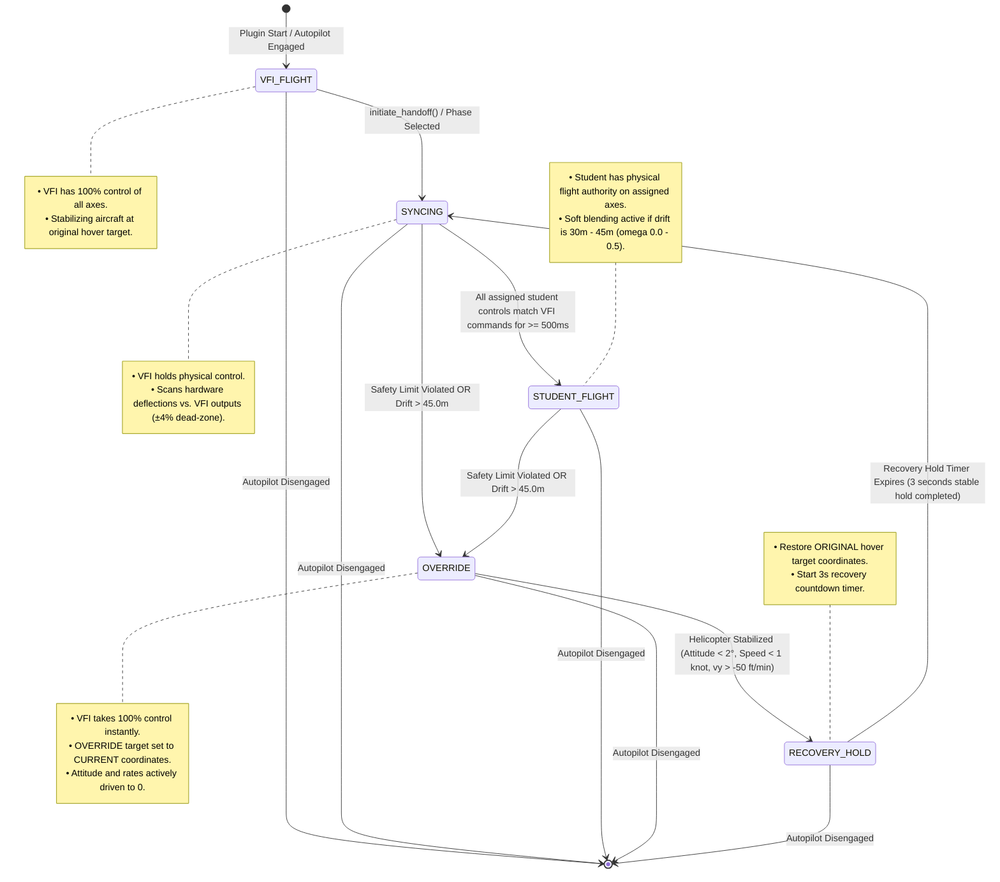

# VFI State Machine & Safety Control Loop Diagram

This document contains a detailed state-machine visualization for the **Virtual Flight Instructor (VFI)** system implemented in `v2`. It outlines the exact transitions, safety checks, and temporary hover target coordinate overrides/restorations that occur during flight instruction.

---

## State Transition Diagram

---

## Detailed State Descriptions

### 1. `VFI_FLIGHT` (Virtual Flight Instructor Flight)
* **Description**: The VFI Autopilot holds 100% flight authority on all four axes (Roll, Pitch, Yaw, Collective).
* **Target Coordinates**: Set to the original hover target point captured when the autopilot was engaged.

### 2. `SYNCING` (Control Alignment Phase)
* **Description**: The instructor prepares to hand off control of the student's assigned axes (depending on the active curriculum phase). To prevent sudden control jumps (jerkiness), X-Plane's native hardware inputs remain overridden while the pilot is instructed to align their physical controls with the active autopilot command within a `±4%` matching window (`match_tolerance = 0.04`).
* **Handoff Condition**: Once all active student axes are held within the matching window continuously for **500ms** (`sync_hold_duration`), the state transitions to `STUDENT_FLIGHT` and authority is hot-swapped to the student.

### 3. `STUDENT_FLIGHT` (Student Flying with Soft Blending)
* **Description**: The student has direct physical control over the assigned axes for the active phase. The remaining axes are held by the VFI.
* **Soft Blending Interventions**: If the student enters any boundary buffer zones (e.g. horizontal drift between 30.0m and 45.0m, or pitch/roll between 10° and 15°), the VFI smoothly blends its stabilization commands (up to `50%` authority) to gently guide the helicopter back.

### 5. `OVERRIDE` (Emergency Takeover & Local Stabilization)
* **Description**: Triggered immediately if the student violates any safety envelope (attitude > 15°, climb/sink > 300 ft/min, AGL < 2.0m or > 10.0m, ground speed > 12 knots) or drifts past the **45.0 meters** safety radius.
* **Takeover Actions**:
  1. Instantly severs student authority and takes 100% VFI control.
  2. Saves the original hover target point (`original_target_x`, `original_target_z`).
  3. Sets the autopilot target coordinates to the helicopter's **current position** (`override_target_x`, `override_target_z`).
  4. Dampens all angular rates and drives attitude toward a level profile.

### 6. `RECOVERY_HOLD` (Stabilized Hold & Target Restoration)
* **Description**: Triggered when the helicopter achieves a stable attitude and zero velocity profile within the local takeover bubble.
* **Stabilization Actions**:
  1. Restores the **original hover target coordinates**, directing the helicopter back to the initial flight line.
  2. Begins a **3-second recovery hold countdown** to ensure absolute flight line stability.
* **Exit Action**: Upon countdown completion, transitions back to `SYNCING` to prompt the student to take control again.
