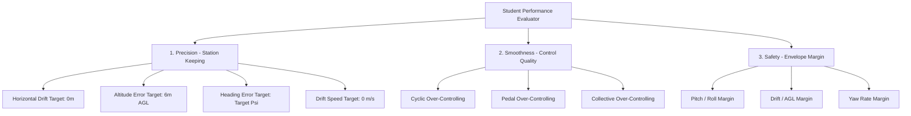

# Student Performance Metrics Specification

This document outlines the software design, mathematical formulation, and active cue configurations for the **Student Performance Metrics** engine in the Helicopter Virtual Flight Instructor (VFI) v2. 

The primary goals are:
1. **Provide immediate visual/aural feedback** to help the "student pilot" build muscle memory and avoid common mistakes (such as over-controlling).
2. **Recognize and praise improvement** with positive reinforcement when they show steady control or recover from drift.
3. **Maintain robust computational efficiency** so that metrics can be computed in real-time at the X-Plane flight loop frequency (50Hz) without causing micro-stutters.

---

## 1. Core Performance Dimensions

To give balanced feedback, we evaluate the student across three distinct dimensions of helicopter flight:



### Dimension 1: Precision (Station-Keeping)
This measures how close the student keeps the helicopter to the designated 3D hover coordinates, target heading, and keeps lateral translation/movement to a minimum.
- **Horizontal Drift ($d_{\text{horiz}}$)**: Distance in meters from the hover target $(x_t, z_t)$.
  $$d_{\text{horiz}} = \sqrt{(x - x_t)^2 + (z - z_t)^2}$$
- **Altitude Deviation ($e_{\text{alt}}$)**: Distance in meters from target height (typically 6.0m AGL).
  $$e_{\text{alt}} = y_{\text{agl}} - y_{\text{target}}$$
- **Heading Deviation ($e_{\text{hdg}}$)**: Wrapped angular error in degrees from the target heading ($\psi_t$).
  $$e_{\text{hdg}} = ((\psi_t - \psi + 180) \pmod{360}) - 180$$
- **Drift Speed ($v_{\text{drift}}$)**: Ground speed in meters per second ($m/s$) calculated from horizontal velocities ($v_x, v_z$).
  $$v_{\text{drift}} = \sqrt{v_x^2 + v_z^2}$$

**Green Zone Scoring Dead-Zones**:
To prevent over-penalizing high-precision station-keeping, errors within the **Excellent (Green) Zone** do not receive a score penalty (yielding a perfect 100% precision component score). Ramped linear penalties are only applied once the student drifts outside the Green Zone boundaries:
- **Heading component**: 100% if $|e_{\text{hdg}}| \le 30.0^\circ$; ramps down to 0% at $60.0^\circ$ error.
- **Altitude component**: 100% if $|e_{\text{alt}}| \le 2.0\text{m}$; ramps down to 0% at $4.0\text{m}$ error.
- **Drift component**: 100% if $d_{\text{horiz}} \le 15.0\text{m}$; ramps down to 0% at $45.0\text{m}$ error.
- **Drift Speed component**: 100% if $v_{\text{drift}} \le 0.5\text{ m/s}$; ramps down to 0% at $2.0\text{ m/s}$ ground speed.
- **Vertical Speed component**: 100% if $|v_y| \le 0.2\text{ m/s}$; ramps down to 0% at $0.8\text{ m/s}$ climb/descent rate.
- **Yaw Speed component**: 100% if $|R| \le 2.0^\circ/\text{s}$; ramps down to 0% at $10.0^\circ/\text{s}$ yaw rate.

### Dimension 2: Smoothness (Control Quality)
A primary challenge for student pilots is **over-controlling** (chasing the helicopter's attitude, leading to Pilot-Induced Oscillations). We measure the rate of change of the student's hardware inputs to determine control smoothness.
- **Control Input Velocity / Jerk Metric ($v_{\text{input}}$)**:
  For any axis $i \in \{\text{roll, pitch, yaw, collective}\}$, the absolute velocity of input changes is computed at 50Hz:
  $$v_i(t) = \frac{|u_i(t) - u_i(t - \Delta t)|}{\Delta t}$$
  Where $u_i(t) \in [-1, 1]$ is the raw hardware stick/pedal deflection.
- **Over-Controlling Index (OCI)**:
  An Exponential Moving Average (EMA) of $v_i(t)$ provides a real-time measure of how "busy" the student is on the controls:
  $$\text{OCI}_i(t) = \alpha \cdot v_i(t) + (1 - \alpha) \cdot \text{OCI}_i(t - \Delta t)$$
  *Setting $\alpha \approx 0.05$ (equivalent to a $\sim 0.4$-second time constant) reacts quickly to sudden jerky inputs while smoothing out normal movement.*

### Dimension 3: Safety (Envelope Margin)
This measures how close the student is to triggering a VFI safety override.
- **Envelope Proximity Score (EPS)**:
  The maximum percentage utilization of any safety limit:
  $$\text{EPS} = \max \left( \frac{|\theta|}{15^{\circ}}, \frac{|\phi|}{15^{\circ}}, \frac{d_{\text{horiz}}}{45\text{m}}, \frac{|R|}{30^{\circ}/\text{s}}, \frac{|v_{\text{speed}}|}{300\text{ft/min}} \right) \times 100\%$$
- **EPS Range Meanings**:
  - **$< 50\%$**: Green Zone (Safe, comfortable).
  - **$50\% - 85\%$**: Yellow Zone (Caution, soft blending begins).
  - **$> 85\%$**: Orange/Red Zone (High takeover risk).

### Dimension 4: Composite Scaling & Honest Control Feedback
To ensure poor stationkeeping (position hold) precision drags overall performance
scores to 0% at takeover boundaries while keeping individual live control
indicators honest:
1. **Unscaled Live Feedback**: Raw physical metrics like OCI (smoothness) and
   speed/rate scores are displayed unscaled to provide accurate feedback (e.g.
   a pilot keeping controls perfectly still sees 100% smoothness).
2. **Stationkeeping Score**: Calculated as the average deviation score across
   all student-controlled axes:
   - Phase 1: $S_{\text{dev}} = \text{comp\_hdg}$
   - Phase 2: $S_{\text{dev}} = \text{comp\_alt}$
   - Phase 3: $S_{\text{dev}} = \frac{\text{comp\_hdg} + \text{comp\_alt}}{2}$
   - Phase 4: $S_{\text{dev}} = \text{comp\_drift}$
   - Phase 5: $S_{\text{dev}} = \frac{\text{comp\_drift} + \text{comp\_hdg}}{2}$
   - Phase 6: $S_{\text{dev}} = \frac{\text{comp\_hdg} + \text{comp\_alt} + \text{comp\_drift}}{3}$
3. **Scaled Composites**: The final Precision Score and Overall Weighted Score
   are scaled by $\frac{S_{\text{dev}}}{100.0}$ so that they correctly converge
   to 0% when the safety margins are violated.

---

## 2. Dynamic Performance Envelopes (60s Window)

Following the initial development roadmap, we define three levels of hovering
proficiency over a 60-second moving window. To calculate perfect and
mathematically precise sliding window averages (e.g., mean and standard
deviation), we will store raw 50Hz telemetry frames in a thread-safe circular
buffer. At 50Hz, a 60-second window requires exactly 3,000 samples, which is
extremely lightweight and easily fits in the available plugin memory.

| Envelope | Precision Requirements | Smoothness Requirements | Safety Margin |
| :--- | :--- | :--- | :--- |
| **Excellent** | Drift $< 15.0$m<br>Alt Err $< 2.0$m<br>Hdg Err $< 30.0^{\circ}$<br>Drift Speed $< 0.5$ m/s<br>Vert Speed $< 0.2$ m/s<br>Yaw Speed $< 2.0^{\circ}$/s | Cyclic OCI $< 0.3$<br>Pedal OCI $< 0.2$ | Always $< 40\%$ EPS (Green) |
| **Good** | Drift, Drift Speed, and Vert Speed between Excellent and Unstable limits | Cyclic OCI $< 0.8$<br>Pedal OCI $< 0.5$ | Always $< 75\%$ EPS (Soft Blending OK) |
| **Unstable** | Drift $> 45.0$m OR Alt Err $> 4.0$m OR Hdg Err $> 60.0^{\circ}$ OR Drift Speed $> 2.0$ m/s OR Vert Speed $> 0.8$ m/s OR Yaw Speed $> 10.0^{\circ}$/s | OCI $> 1.5$ (Wildly hammering cyclic/pedals) | EPS $\ge 100\%$ (Triggers takeover) |

---

## 3. Immediate Feedback & Training Cues

To guide the student's learning in real-time, the Virtual Flight Instructor will provide immediate audio/visual feedback when specific thresholds are breached.

```
       +---------------------------------------------+
       | [VFI HUD]               PHASE 6: FULL HOVER |
       +---------------------------------------------+
       | Precision Score: 92% (Excellent)            |
       | Control Smoothness: 84% [||||||||||......]  |
       |                                             |
       |  -> TIP: Make smaller, calmer corrections.  |
       +---------------------------------------------+
```

### Educational Audio/Visual Cues (Immediate Feedback)

1. **Jerky Cyclic (Roll/Pitch OCI $> 1.0$ for $> 1.5$ seconds)**:
   - *Voice*: `"Make smaller cyclic corrections."` or `"Relax your grip on the cyclic."`
   - *OSD HUD*: Show blinking yellow cyclic symbol to indicate over-control.
2. **Jerky Pedals (Yaw OCI $> 0.8$ for $> 1.5$ seconds)**:
   - *Voice*: `"Steady your feet on the pedals."`
   - *OSD HUD*: Blinking yellow pedal slider.
3. **Chasing the Altitude (Collective OCI $> 0.8$)**:
   - *Voice*: `"Small, smooth collective adjustments only."`
4. **Drift Warning (Horizontal drift $> 25$ meters and increasing)**:
   - *Voice*: `"Correct the drift."`
   - *OSD HUD*: Blinking yellow drift error indicator.
5. **Altitude Margin Warning (Altitude within 0.5m of safety limits: $2.5$m or $9.5$m)**:
   - *Voice*: `"We are too low."` (if AGL $< 3.0$m) or `"We are too high."` (if AGL $> 9.0$m).

---

## 4. Praise Cues (Positive Reinforcement)

To keep the student motivated, the instructor should verbally reward them when they maintain a high quality of flight or show significant improvement.

> [!IMPORTANT]
> **Drift Speed Constraint**: To ensure the praise represents a truly stabilized hover, the instructor will not praise the student if their horizontal drift velocity (ground speed) exceeds $1.0\text{ m/s}$. If drift speed exceeds this threshold, the corresponding praise timers are reset.

### Praise Triggers (Spoken Cues)

1. **"Perfect Hover" (Existing cue, but let's formalize the condition)**:
   - *Condition*: Holds **Excellent** envelope variables for 10 continuous seconds.
   - *Voice*: Plays `"Perfect.wav"` or says `"Excellent hover, holding steady."`
2. **"Pedal Master" (Specific praise for yaw)**:
   - *Condition*: In a phase where pedals are student-controlled (Phase 1, 3, 5, 6), student maintains $|e_{\text{hdg}}| < 5^{\circ}$ and Yaw rate $< 3^{\circ}/\text{s}$ for 15 seconds.
   - *Voice*: `"Great pedal control."`
3. **"Successful Recovery" (Praising correction)**:
   - *Condition*: Student was in the caution/yellow zone (drift $> 15$m or heading $> 20^{\circ}$) and successfully guides the helicopter back to the green zone (drift $< 5$m, heading $< 10^{\circ}$) without VFI takeover.
   - *Voice*: `"Nice recovery."` or `"Good correction back to target."`
4. **"Smooth Hands" (Praising control inputs)**:
   - *Condition*: Over a 30-second window, average Cyclic OCI remains $< 0.2$ while maintaining a **Good** or **Excellent** hover.
   - *Voice*: `"Very smooth cyclic inputs, keep it up."`

---

## 5. UI Integration Strategy

We can present these metrics to the user on two interfaces:
1. **The Live OSD (HUD)**: A minimal "Smoothness" bar gauge and a rolling percentage performance index.
2. **The ImGui Control Panel**: A new "Performance Metrics" tab containing:
   - Current 60-second score breakdown (Precision, Smoothness, Drift Speed, Safety).
   - Historical session stats (number of takeovers, longest student flight duration, average drift).
   - An "Instructor Tips" box dynamically recommending what to focus on (e.g., *"Focus on yaw control; your cyclic inputs are very smooth, but pedals are active."*).

---

## 6. Verification and Testability

To maintain high development quality (Google Python Style Guide), the performance metrics subsystem should be fully unit-testable:
- We will isolate metric calculations inside a new class or package module (e.g. `helicopter_instructor/metrics.py`).
- All functions will accept raw inputs/states so we can mock flight profiles and verify that:
  - JERK and OCI calculate correctly under varying frequency workloads.
  - Correct audio filenames/HUD notifications are queued at the exact threshold durations.
  - Standard unit tests in `tests/test_metrics.py` will guarantee 100% coverage.
